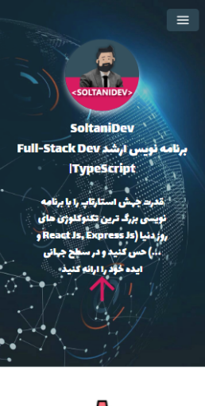

This is a [SoltaniDev](https://soltanidev.com/) portfolio bootstrapped with [`create-next-app`](https://github.com/vercel/next.js/tree/canary/packages/create-next-app).

## Features

- 🔥 Next.js for Static Site Generator
- 🎨 Integrate with Chakra UI
- 🎉 Type checking TypeScript
- ✅ React-query for fetching data
- 🌈 Zustand for state management
- 🗂 PWA technology for Progressive Web Apps
- 🔥 Zod for type-safe data fetching

## Philosophy

- 🚀 Production-ready
- 🛠 SEO-friendly

## Deploy on Vercel

The easiest way to deploy your Next.js app is to use the [Vercel Platform](https://vercel.com/new?utm_medium=default-template&filter=next.js&utm_source=create-next-app&utm_campaign=create-next-app-readme) from the creators of Next.js.

Check out our [Next.js deployment documentation](https://nextjs.org/docs/deployment) for more details.
